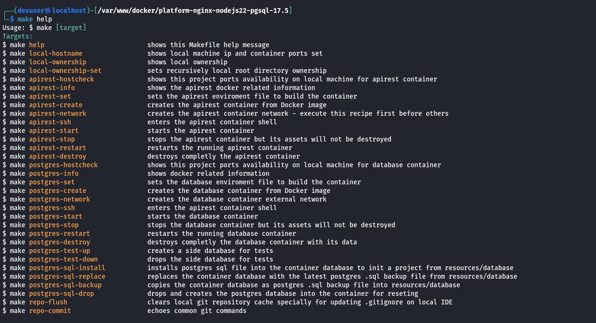

<div id="top-header" style="with:100%;height:auto;text-align:right;">
    
</div>

# INFRASTRUCTURE PLATFORM

# NGINX 1.28, NODEJS 22.16, POSTGRES 16.4

[](https://shields.io/)
[](./)
[](./LICENSE)

## Repository Overview

This Infrastructure Platform repository provides a dedicated Node.js stack for back-end API projects, enabling developers to work within a consistent local development framework that closely mirrors real-world deployment scenarios. Whether your application will run on **AWS EC2**, **Google Cloud GCE**, **Azure** instances, **VPS** or be distributed across **Kubernetes pods**, this structure ensures smooth transitions between environments.

### Modular and Decoupled Design

A key feature of this repository is its modular design: it is intentionally decoupled from its sub-directory `./apirest`, allowing the platform to be maintained independently without impacting the associated subproject. This separation supports dedicated upkeep and flexibility for both the platform and its detached web application.

### Multi-instance Local Development

Additionally, the platform is designed to support running multiple development versions of the `./apirest` simultaneously, simply by adjusting a few environment settings to differentiate each container instance. It is highly configurable to accommodate various infrastructure or machine requirements, allowing developers to easily tailor parameters such as container RAM allocation, port assignments, and other platform settings to best fit their local or deployment environment.
<br>

## Content of this page:

- [Requirements](#requirements)
- [Platform Features](#platform-features)
- [API Service Container Setting](#api-settings)
- [Database Service Container Setting](#db-settings)
- [Platforms Containers Build Automation](#platform-automation)
- [Build and Run Platforms Docker Containers](#building-containers)
- [GNU Make file recipes](#make-help)
- [Use this Platform Repository for REST API project](#platform-usage)
<br><br>

## <a id="requirements"></a>Requirements


Despite Docker’s cross-platform compatibility, for intermediate to advanced software development on environments other than Windows NT or macOS, automating the platform build and streamlining the process of starting feature development is crucial. This automation enables a more dynamic and efficient software development lifecycle.

- **Docker**: Containerizes applications for consistent environments.
- **Docker Compose**: Manages multi-container setups and dependencies.
- **GNU Make**: Automates build commands and workflows *(otherwise, commands must be executed manually)*.

If you won't use GNU Make, Docker commands will have to be executed from within the `./platform/nginx-nodejs/docker` and `./platform/postgres-16.4/docker` directories, e.g.:
```bash
./platform/nginx-nodejs/docker $ sudo docker compose up --build --no-recreate -d
```

| Dev machine   | Machine's features                                                                            |
| ------------- | --------------------------------------------------------------------------------------------- |
| CPU           | Linux *(x64 - x86)* /  MacOS Intel *(x64 - x86)*, or M1                                       |
| RAM           | *(for this container)*: 1 GB minimum.                                                         |
| DISK          | 2 GB *(though is much less, it usage could be incremented depending on the project usage)*.   |
<br>

## <a id="platform-features"></a>Platform Features


It can be installed the most known JS **back-end / API** frameworks:

- [Express](https://expressjs.com/)
- [Nest](https://nestjs.com/)
- [LoopBack](https://loopback.io/)
- [Fastify](https://fastify.dev/)
- Others...
<br>

Take into account that each framework will demand its specific configuration from inside container.
<br><br>

## <a id="api-settings"></a>API Service Container Setting

The container instance has its dedicated GNU Make and the core Docker directory which contains the scripts and stack assets to build the required platform configuration.

Also, there is a copy at `./resources/docs/platform/` directory to contain the exact or the alternated scripts, so you can save or backup the different SDLC required configuration *(e.g. Testing, Staging, Production)*.

Content:
- Linux Alpine version 3.22
- NGINX version 1.28 *(or the latest on Alpine Package Keeper)*
- NodeJS 22.16 *(upgradable)*
<br>

> **Note**: There is a `./platform/nginx-nodejs/docker/.env.example` file with the variables required to build the container by `docker-compose.yml` file to create the container. Otherwise, if no GNU Make is available on developer's machine, it is required to create its `.env` manually to build the container.

API environment file content at `./platform/nginx-nodejs/docker`:
```bash
COMPOSE_PROJECT_LEAD="myproj"
COMPOSE_PROJECT_CNET="mp-dev"
COMPOSE_PROJECT_IMGK="alpine3.21-nginx1.28-njs22"
COMPOSE_PROJECT_NAME="mp-apirest-dev"
COMPOSE_PROJECT_HOST="127.0.0.1"
COMPOSE_PROJECT_PORT=7501
COMPOSE_PROJECT_PATH="../../../apirest"
COMPOSE_PROJECT_MEM="128M"
COMPOSE_PROJECT_SWAP="512M"
COMPOSE_PROJECT_USER="myproj"
COMPOSE_PROJECT_GROUP="myproj"
```
<br>

## <a id="db-settings"></a>Database Service Container Setting


Inside `./platform/pgsql-16.4` there are a dedicated GNU Make file and the main Docker directory with the scripts to build the required platform configuration adapted from [PostgreSQL GitHub repository source](https://github.com/docker-library/postgres/blob/master/17/alpine3.22/docker-entrypoint.sh)

Content:
- Linux Alpine version 3.22
- Postgres 16.4
<br>

> **Note**: There is a `./platform/pgsql-16.4/docker/.env.example` file with the variables required to build the container by `docker-compose.yml` file to create the container. Otherwise, if no GNU Make is available on developer's machine, it is required to create its `.env` manually to build the container.

Database environment file content at `./platform/pgsql-16.4/docker`:
```bash
COMPOSE_PROJECT_LEAD="myproj"
COMPOSE_PROJECT_CNET="mp-dev"
COMPOSE_PROJECT_IMGK="alpine3.22-pgsql-16.4"
COMPOSE_PROJECT_NAME="mp-pgsql-dev"
COMPOSE_PROJECT_HOST="127.0.0.1"
COMPOSE_PROJECT_PORT=7500
COMPOSE_PROJECT_MEM="128M"
COMPOSE_PROJECT_SWAP="512M"
POSTGRES_DATABASE=myproj_local
POSTGRES_USER=myproj
POSTGRES_PASSWORD="J4YPuJaieJ35gNAOSQQor87s82q2eUS1"
```
<br>

## <a id="platform-automation"></a>Platforms Containers Build Automation

Create the root `./.env` file from the [./.env.example](./.env.example) and follow its description to configure the platforms. The end result would be like this:
```bash
SUDO=sudo
DOCKER=sudo docker
DOCKER_COMPOSE=sudo docker compose

PROJECT_NAME="MY PROJECT"
PROJECT_LEAD=myproj
PROJECT_HOST="127.0.0.1"
PROJECT_CNET=mp-dev

APIREST_PLTF=nginx-nodejs
APIREST_IMGK=alpine3.21-nginx1.28-njs22
APIREST_PORT=7501
APIREST_BIND="../../../apirest"
APIREST_CAAS=mp-apirest-dev
APIREST_CAAS_USER=myproj
APIREST_CAAS_GROUP=myproj
APIREST_CAAS_MEM=128M
APIREST_CAAS_SWAP=512M
APIREST_GIT_SSH=~/.ssh/id_rsa
APIREST_GIT_HOST=github.org
APIREST_GIT_BRANCH=develop
APIREST_DOMAIN=

DATABASE_PLTF=pgsql-16.4
DATABASE_IMGK=alpine3.22-pgsql-16.4
DATABASE_PORT=7500
DATABASE_CAAS=mp-pgsql-dev
DATABASE_CAAS_MEM=128M
DATABASE_CAAS_SWAP=512M
DATABASE_ROOT="sk5U2phvnjAMRe2wy0aD0ztCQaDusywp"
DATABASE_NAME=myproj_local
DATABASE_USER=myproj
DATABASE_PASS="J4YPuJaieJ35gNAOSQQor87s82q2eUS1"
DATABASE_PATH="/resources/database/"
DATABASE_INIT=pgsql-init.sql
DATABASE_BACK=pgsql-backup.sql
```

Once this environment file is set, it can be created each container instance's `.env` automatically by using GNU Make:

Set up the API container
```bash
$ make apirest-set
```
<div style="with:100%;height:auto;text-align:center;">
    
</div>

Set up the database container
```bash
$ make postgres-set
```
<div style="with:100%;height:auto;text-align:center;">
    
</div>
<br>

Watch the local hostname IP and ports on which Docker containers will be served, even though the API can be accessed through `http://127.0.0.1` or `http://localhost`
```bash
$ make local-hostname
```
<div style="with:100%;height:auto;text-align:center;">
    
</div>
<br>

## <a id="building-containers"></a>Build and Run Platforms Docker Containers

Create and start up the API container
```bash
$ make apirest-create
```

<span color="orange"><b>IMPORTANT:</b></span> Once the container is built and running, the Nginx server block serves at port 80 proxing to port 3000 to be handled by NodeJS. On first installation will fail as it is needing to install the required packages with NPM from inside the container.

<div style="with:100%;height:auto;text-align:center;">
    
</div>
<br>

<div style="with:100%;height:auto;text-align:center;">
    
</div>
<br>

To preview the successful installation on browser, there is a basic home page sample at `./resources/docs/apirest/default-install/`. Copy its content into `./apirest` directory
```bash
$ cp -a ./resources/docs/apirest/default-install/. ./apirest
```

Then, access into the container to install required Node JS packages and restart the container
```bash
$ make apirest-ssh

/var/www $ npm install
/var/www $ exit

$ make apirest-restart
```

> **Note**: Depending the date of the installation, NPM could require to be updated. **Only this NPM update** requires sudo privileges - *projects do not*.

<div style="with:100%;height:auto;text-align:center;">
    
</div>
<br>

Now you can see the NodeJS application running succesfully by visiting http://localhost:{port}/ on browser, but without the database connection established correctly, the sample home page will show a **Postgres** failure message.

<div style="with:100%;height:auto;text-align:center;">
    
</div>
<br>

**REMEMBER** to set the selected port that will serve Postgres instance in the `./apirest/index.js` script. The changes will be set on container automatically as script is on `--watch` mode.

Build and run the database container instance
```bash
$ make postgres-create
```
<div style="with:100%;height:auto;text-align:center;">
    
</div>
<br>

Testing containers visiting localhost with the assigned port, and with a database connected
<div style="with:100%;height:auto;text-align:center;">
    
</div>
<br>

Docker information for both container up and running
<div style="with:100%;height:auto;text-align:center;">
    
</div>
<div style="with:100%;height:auto;text-align:center;">
    
</div>
<br>

Also there is a **useful GNU Make recipe** to see the container relevant information. This is important when is developing on dev mode inside the container, when for this example, you would see the framework development stage on Docker port, e.g. `http://172.18.0.2:{port}` ***<- this port can be assigned from project's framework configurations***

<div style="with:100%;height:auto;text-align:center;">
    
</div>
<br>

Despite each container can be stop or restarted, they can be stop and destroy both containers simultaneously to clean up locally from Docker generated cache, without affecting other containers running on the same machine.
```bash
$ make apirest-destroy postgres-destroy
```
<div style="with:100%;height:auto;text-align:center;">
    
</div>
<br>

## <a id="make-help"></a>GNU Make file recipes

The project's main `./Makefile` contains recipes with the commands required to manage each platform's Makefile from the project root.

This streamlines the workflow for managing containers with mnemonic recipe names, avoiding the effort of remembering and typing each bash command line.

<div style="with:100%;height:auto;text-align:center;">
    
</div>
<br>

## <a id="platform-usage"></a>Use this Platform Repository for your REST API Project

Clone the platforms repository
```bash
$ git clone https://github.com/pabloripoll/docker-platform-nginx-nodejs-22-pgsql-16.4
$ cd docker-platform-nginx-nodejs-22-pgsql-16.4
```

Repository directories structure overview:
```
.
├── apirest (Express, Nest, etc.)
│   ├── node_modules
│   ├── index.js
│   ├── package.json
│   └── ...
│
├── platform
│   ├── nginx-nodejs
│   │   ├── docker
│   │   │   │   ├── nginx
│   │   │   │   └── supervisord
│   │   │   ├── config
│   │   │   ├── .env
│   │   │   ├── docker-compose.yml
│   │   │   └── Dockerfile
│   │   │
│   │   └── Makefile
│   └── postgres-16.4
│       ├── docker
│       └── Makefile
├── .env
├── Makefile
└── README.md
```
<br>

Here’s a step-by-step guide for using this Platform repository along with your own API project:

- Remove the existing `./apirest` directory contents from local and from git cache
- Install your desired repository inside `./apirest`
- Choose between Git submodule and detached repository approaches
<br>

## Managing the `apirest` Directory: Submodule vs Detached Repository

To remove the `./apirest` directory with the default installation content and install your desired repository inside it, there are two alternatives for managing both the platform and apirest repositories independently:

### 1. **GIT Sub-module**

> Git commands can be executed **only from inside the container**.

- Remove `apirest` from local and git cache:
  ```bash
  $ rm -rfv ./apirest/* ./apirest/.[!.]*$
  $ git rm -r --cached apirest
  $ git commit -m "Remove apirest directory and its default installation"
  ```

- Add the desired repository as a submodule:
  ```bash
  $ git submodule add git@[vcs]:[account]/[repository].git ./apirest
  $ git commit -m "Add apirest as a git submodule"
  ```

- To update submodule contents:
  ```bash
  $ cd ./apirest
  $ git pull origin main  # or desired branch
  ```

- To initialize/update submodules after `git clone`:
  ```bash
  $ git submodule update --init --recursive
  ```

---

### 2. **GIT Detached Repository (Recommended)**

> Git commands can be executed **whether from inside the container or on the local machine**.

- Remove `apirest` from local and git cache:
  ```bash
  $ rm -rfv ./apirest/* ./apirest/.[!.]*
  $ git rm -r --cached apirest
  $ git clean -fd
  $ git reset --hard
  $ git commit -m "Remove apirest directory and its default installation"
  ```

- Clone the desired repository as a detached repository:
  ```bash
  $ git clone git@[vcs]:[account]/[repository].git ./apirest
  ```

- The `apirest` directory is now an **independent repository**, not tracked as a submodule in your main repo. You can use `git` commands freely inside `apirest` from anywhere.

---

#### **Summary Table**

| Approach         | Repo independence | Where to run git commands | Use case                        |
|------------------|------------------|--------------------------|----------------------------------|
| Submodule        | Tracked by main  | Inside container         | Main repo controls webapp version|
| Detached (rec.)  | Fully independent| Local or container       | Maximum flexibility              |

---

Once the container is up, Supervisor will run the sample API script. See `./platform/nginx-nodejs/docker/config/supervisor/conf.d/nodejs.conf`
```bash
[program:nodejs]
command=node --watch /var/www/index.js
stdout_logfile=/dev/stdout
stdout_logfile_maxbytes=0
stderr_logfile=/dev/stderr
stderr_logfile_maxbytes=0
autorestart=false
startretries=0
```

> **Note**: If API main script is other, remember to modify this file.

> After switching to either alternative, consider adding `/apirest` to your `.gitignore` in this main platform repository to prevent accidental tracking *(especially for detached repository)*.

<br>

---

## Contributing

Contributions are very welcome! Please open issues or submit PRs for improvements, new features, or bug fixes.

1. Fork the repository
2. Create your feature branch (`git checkout -b feature/YourFeature`)
3. Commit your changes (`git commit -am 'feat: Add new feature'`)
4. Push to the branch (`git push origin feature/YourFeature`)
5. Create a new Pull Request

---

## License

This project is open-sourced under the [MIT license](LICENSE).

<!-- FOOTER -->
<br>

---

<br>

- [GO TOP ⮙](#top-header)

<div style="with:100%;height:auto;text-align:right;">
    
</div>